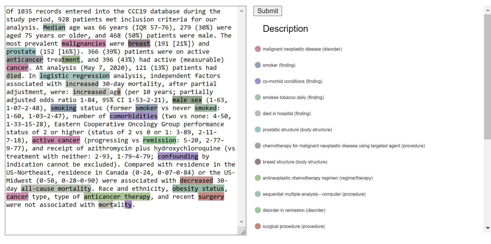

# Snowmed-Entity-Linking
App for Entity linking on the [SNOMED CT](https://www.snomed.org/five-step-briefing), a knowledge graph of clinical healthcare terminology. 

## Screenshot

## Motivation
Much of the world's healthcare data is stored in free-text documents, usually clinical notes taken by doctors. This unstructured data can be challenging to analyze and extract meaningful insights from.
However, by applying a standardized terminology like SNOMED CT, healthcare organizations can convert this free-text data into a structured format that can be readily analyzed by computers, in turn stimulating the development of new medicines, treatment pathways, and better patient outcomes.
