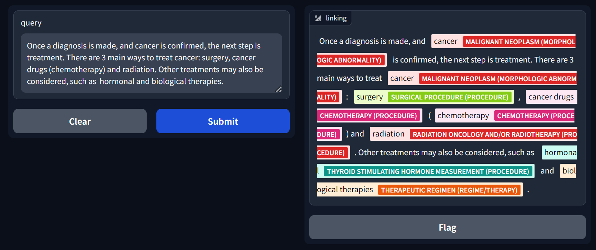

# SNOMED-Entity-Linking
A [Gradio](https://www.gradio.app/) app for Entity linking on the [SNOMED CT](https://www.snomed.org/five-step-briefing), a knowledge graph of clinical healthcare terminology.

[website : huggingface.co/spaces/xlreator/SNOMED-Entity-Linking](https://huggingface.co/spaces/xlreator/SNOMED-Entity-Linking)

## Motivation
Much of the world's healthcare data is stored in free-text documents, usually clinical notes taken by doctors. This unstructured data can be challenging to analyze and extract meaningful insights from.
However, by applying a standardized terminology like SNOMED CT, we can the interpretability of these notes for patients and individuals outside the organization of origin.
Moreover, healthcare organizations can convert this free-text data into a structured format that can be readily analyzed by computers, in turn stimulating the development of new medicines, treatment pathways, and better patient outcomes.

Here, we use entity linking to analyze clinical notes identifying and labeling the portions of each note that correspond to specific medical concepts.

# Methodology
The pipline involves two models, one for segmentation and the other for disambiguation (classification of the segmentations).
The segmentation model is a [CANINE-s](https://huggingface.co/google/canine-s) character-level transformer model finetuned to optimise the BCE, Dice, and Focal loss each weighted 1, 1, .1 respectively. The objective function is then optimised using Adam with a learning rate of 1e-5.
The classification model uses the [BioBERT](https://huggingface.co/dmis-lab/biosyn-biobert-bc5cdr-disease) model. Here, the model is trained similarly using Adan and a learning rate of 2e-5. We train using the [MultipleNegativesRankingLoss](https://arxiv.org/pdf/1705.00652) using the [SentenceTransformers](https://sbert.net/) library.

## Dataset
The dataset used to train the models is the dataset used for the [SNOMED CT Entity Linking Challenge](https://physionet.org/content/snomed-ct-entity-challenge/1.0.0/), which is a subset of [MIMIC-IV-Note](https://physionet.org/content/mimic-iv-note/2.2/) of 75,000 entity annotations across about 300 discharge notes.
For the sake of simplicity we only include entities with more than 10 mentions.

## Results
Test set Macro char IoU: 0.3149

# References 
- Hardman, W., Banks, M., Davidson, R., Truran, D., Ayuningtyas, N. W., Ngo, H., Johnson, A., & Pollard, T. (2023). SNOMED CT Entity Linking Challenge (version 1.0.0). PhysioNet. https://doi.org/10.13026/s48e-sp45.
- Goldberger, A., Amaral, L., Glass, L., Hausdorff, J., Ivanov, P. C., Mark, R., ... & Stanley, H. E. (2000). PhysioBank, PhysioToolkit, and PhysioNet: Components of a new research resource for complex physiologic signals. Circulation [Online]. 101 (23), pp. e215–e220.
- Jinhyuk Lee, Wonjin Yoon, Sungdong Kim, Donghyeon Kim, Sunkyu Kim, Chan Ho So, Jaewoo Kang, BioBERT: a pre-trained biomedical language representation model for biomedical text mining, Bioinformatics, Volume 36, Issue 4, February 2020, Pages 1234–1240, https://doi.org/10.1093/bioinformatics/btz682
- Henderson, M., Al-Rfou, R., Strope, B., Sung, Y., Lukács, L., Guo, R., Kumar, S., Miklos, B., & Kurzweil, R. (2017). Efficient Natural Language Response Suggestion for Smart Reply. ArXiv, abs/1705.00652.
- Reimers, N., & Gurevych, I. (2019). Sentence-BERT: Sentence Embeddings using Siamese BERT-Networks. Conference on Empirical Methods in Natural Language Processing.
